# Data Engineering Lab 🚀

> *May the pipeline be with you.*

A local batch data engineering project built with **Python and pandas** to move questionable CSV files from the **Dark Side of raw data** toward clean, enriched, and actually useful analytics.

The project started as a recreation of the KodeKloud **Data Engineering Fundamentals** pipeline and then evolved into a modular Python pipeline with reusable stages and centralized orchestration.

The sample dataset happens to involve Star Wars characters buying suspicious amounts of coffee.

Apparently even Darth Vader needs caffeine.

---

## 🚀 The Pipeline

Our mission is simple:

**Take messy orders. Reject Sith data. Produce Jedi analytics.**

```mermaid
flowchart LR

    A[Monthly Orders CSV] --> B[Duplicate Check]

    B --> C{Already Ingested?}

    C -- Yes --> D[Skip File]

    C -- No --> E[Ingest]

    E --> F[Schema Validation]

    F --> G[Archive Raw File]

    G --> H[Write Ingestion Log]

    H --> I[Clean]

    I --> J[Missing Value Validation]
    J --> K[Date Validation]
    K --> L[Numeric Validation]
    L --> M[Duplicate Detection]
    M --> N[Customer ID Validation]
    N --> O[Product ID Validation]

    O --> P[Transform]

    P --> Q[Join Customer Data]
    Q --> R[Join Product Data]
    R --> S[Calculate Line Revenue]
    S --> T[Aggregate Business Metrics]

    T --> U[Serve]

    U --> V[CSV Analytics]
    U --> W[PNG Charts]
```



The pipeline follows four major stages:

**Ingest → Clean → Transform → Serve**

---

# 1. Ingest — A New Hope

Every adventure begins with somebody dropping a CSV file into a folder.

The ingestion stage:

- Detects a new orders CSV.
- Checks whether we've already processed it, because processing the same file twice is how civilizations collapse.
- Loads the file using pandas.
- Validates the expected schema.
- Counts the incoming rows.
- Creates a monthly output directory.
- Saves a validated copy of the dataset.
- Archives the original raw file.
- Records the ingestion event in an audit log.

The expected orders schema is:

```text
order_id
customer_id
product_id
quantity
order_date
```

The ingestion stage also provides **duplicate-ingestion protection**.

If an incoming filename already exists in the ingestion log, the pipeline skips it.

In other words:

```text
Raw CSV enters
      ↓
Have we seen this thing before?
      ↓
Schema looks sane?
      ↓
Archive + Log
      ↓
Continue
```

Hopefully valid CSV leaves.

---

# 2. Clean — The Data Strikes Back

Raw data cannot be trusted.

Not even slightly.

The cleaning stage checks for:

- Missing required values.
- Dates that aren't actually dates.
- Numbers that aren't actually numbers.
- Negative numeric values.
- Duplicate rows.
- Customers who apparently don't exist.
- Products that apparently don't exist.
- Other disturbances in the data Force.

The customer and product checks provide basic **referential integrity** between the orders dataset and the reference datasets.

Bad records aren't silently destroyed.

They are preserved in:

```text
orders_dropped.csv
```

because good data engineering means keeping evidence of what happened.

### Current casualty report

The sample batch contains 50 incoming orders.

| Status | Rows |
| --- | ---: |
| Entered the pipeline | 50 |
| Banished to the Dark Side | 10 |
| Survived cleaning | 40 |

The rejected records included:

```text
Missing required values:     1
Invalid dates:               2
Invalid quantities:          2
Duplicate rows:              0
Invalid customer IDs:        4
Invalid product IDs:         1
```

**80% survival rate. The Force was reasonably strong with this dataset.**

The cleaning stage produces:

```text
orders_clean.csv
orders_dropped.csv
```

---

# 3. Transform — Return of the JOIN

Now that the data is trustworthy, we can actually do something with it.

The cleaned orders are enriched using two reference datasets:

```text
customers.csv
products.csv
```

The transformation stage performs joins to add:

- Customer names.
- Product names.
- Product prices.

It then calculates revenue for each order line:

```text
line_total = quantity × price
```

This finally allows the pipeline to answer the important questions facing the galaxy:

- Which beverage generates the most revenue?
- Which customers spend the most?
- Why is Chewbacca buying so much coffee?

The enriched dataset is saved as:

```text
orders_enriched.csv
```

## ☕ Top Products by Revenue

| Product | Revenue |
| --- | ---: |
| Blue Milk Latte | $103.50 |
| Wookiee Cappuccino | $73.50 |
| Tatooine Mocha | $72.00 |

**Blue Milk Latte wins.**

Somewhere, Luke Skywalker is probably responsible.

## 👑 Top Customers by Spend

| Customer | Spend |
| --- | ---: |
| Chewbacca | $62.00 |
| Leia Organa | $59.50 |
| Darth Vader | $53.50 |

**Chewbacca is our best customer.**

This raises questions the pipeline is not currently equipped to answer.

---

# 4. Serve — Revenge of the Charts

Clean analytical data sitting on a filesystem isn't particularly exciting.

The serving stage takes the transformed analytical results and produces outputs that humans and downstream systems can consume.

The pipeline generates:

```text
top_products.csv
top_customers.csv
top_products.png
top_customers.png
```

The CSV files provide reusable analytical datasets.

Matplotlib turns the aggregates into bar charts so humans don't have to stare at DataFrames all day.

---

# 🧩 From Scripts to a Modular Pipeline

The project was deliberately built in two stages.

## Version 1 — Learn the Pieces

The first implementation consists of standalone scripts:

```text
pipeline/
├── ingest.py
├── clean.py
├── transform.py
└── serve.py
```

Each stage was developed and executed independently.

This made it easier to understand exactly what happened during:

```text
Ingest
   ↓
Clean
   ↓
Transform
   ↓
Serve
```

## Version 2 — Make It Reusable

The second implementation refactors those stages into reusable Python modules:

```text
pipeline_v2/
├── __init__.py
├── ingest.py
├── clean.py
├── transform.py
└── serve.py
```

Each stage exposes a `run()` function.

For example:

```text
ingest.run(...)
clean.run(...)
transform.run(...)
serve.run(...)
```

A central runner coordinates them:

```text
run_pipeline_v2.py
```

The resulting architecture is:

```text
              run_pipeline_v2.py
                       |
                       v
                 ingest.run()
                       |
                       | output_folder
                       v
                  clean.run()
                       |
                       v
                transform.run()
                       |
                       | top_products
                       | top_customers
                       v
                  serve.run()
                       |
                       v
              Analytics + Charts
```

This separates **pipeline orchestration** from the implementation of individual processing stages.

---

# 📁 Project Structure

```text
data-engineering-lab/
│
├── data/
│   ├── archive/
│   ├── customers.csv
│   └── products.csv
│
├── insights/
│   └── YYYY_MM/
│       ├── orders.csv
│       ├── orders_clean.csv
│       ├── orders_dropped.csv
│       ├── orders_enriched.csv
│       ├── top_products.csv
│       ├── top_customers.csv
│       ├── top_products.png
│       └── top_customers.png
│
├── logs/
│   └── ingest_log.csv
│
├── pipeline/
│   ├── ingest.py
│   ├── clean.py
│   ├── transform.py
│   └── serve.py
│
├── pipeline_v2/
│   ├── __init__.py
│   ├── ingest.py
│   ├── clean.py
│   ├── transform.py
│   └── serve.py
│
├── run_pipeline_v2.py
├── .gitignore
└── README.md
```

Generated analytics, runtime logs, archived raw files, and the Python virtual environment are excluded from Git.

---

# ⚡ Execute Order 66

Okay, not *that* Order 66.

Clone the repository and enter the project directory.

Create a Python virtual environment:

```bash
python3 -m venv .venv
```

Activate it:

```bash
source .venv/bin/activate
```

Install the dependencies:

```bash
pip install pandas matplotlib
```

Place an orders file in the `data/` directory using a name such as:

```text
orders_2025_10.csv
```

The reference datasets should also exist:

```text
data/
├── customers.csv
├── products.csv
└── orders_2025_10.csv
```

Then launch the entire pipeline:

```bash
python run_pipeline_v2.py
```

One command executes:

```text
Detect
  ↓
Duplicate Check
  ↓
Ingest
  ↓
Schema Validation
  ↓
Archive
  ↓
Clean
  ↓
Transform
  ↓
Serve
```

No stormtroopers required.

---

# 🔍 Data Engineering Concepts Demonstrated

Despite the questionable coffee habits of the customers, the project demonstrates several real data engineering concepts.

### Batch ingestion

Incoming order files are processed as discrete batches.

### Idempotency

The ingestion log prevents the same input file from being processed repeatedly.

### Schema validation

Incoming files are checked against an expected structure before downstream processing.

### Data-quality validation

Records are checked for missing values, malformed dates, invalid numeric fields, and duplicates.

### Referential integrity

Orders must reference customers and products that actually exist.

A surprisingly high bar for the Empire.

### Auditability

Rejected records are preserved rather than silently discarded.

Raw files are archived after successful ingestion.

### Data enrichment

Orders are joined with customer and product reference datasets.

### Derived metrics

Revenue is calculated from:

```text
quantity × price
```

### Aggregation

The pipeline calculates product revenue and customer spending.

### Modular design

Pipeline stages are implemented as reusable functions rather than one giant script held together by hope.

### Orchestration

`run_pipeline_v2.py` coordinates execution of the complete workflow.

### Serving

Processed analytical datasets and visualizations are produced for downstream consumption.

---

# 🏷️ Version History

## v0.1.0 — The Pipeline Awakens

The first working end-to-end modular batch pipeline.

Includes:

- File-based batch ingestion.
- Duplicate-processing protection.
- Schema validation.
- Raw-data archival.
- Ingestion audit logging.
- Data-quality cleaning.
- Referential-integrity validation.
- Rejected-record tracking.
- Customer and product enrichment.
- Revenue calculations.
- Product and customer aggregations.
- CSV analytical outputs.
- Matplotlib visualizations.
- Reusable pipeline functions.
- Single-command orchestration.

Most importantly:

```text
50 orders entered.
40 orders survived.
Chewbacca bought the most coffee.
```

Science.

---

# 🛠️ What's Next?

`v0.1.0` proves that the pipeline works.

Future versions will attempt increasingly irresponsible levels of data engineering:

- Centralized configuration.
- Structured application logging.
- Automated unit tests.
- Integration tests.
- PostgreSQL storage.
- Docker-based infrastructure.
- Workflow orchestration.
- Bronze / Silver / Gold data architecture.
- PySpark.
- Distributed processing.
- Databricks-style architecture.
- AWS-native data services.

Eventually this tiny coffee pipeline may become a distributed data platform.

Or it may discover that Chewbacca has a caffeine problem.

We'll see which happens first.

---

## Technologies

- Python
- pandas
- Matplotlib
- Git
- WSL2
- Visual Studio Code

---

*Built while learning data engineering one questionable CSV at a time.*