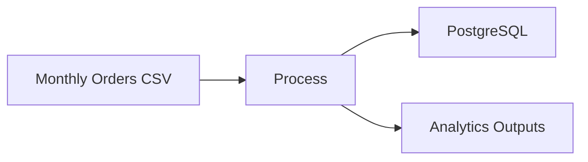
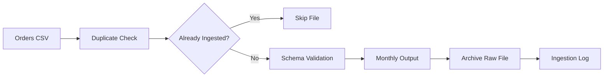
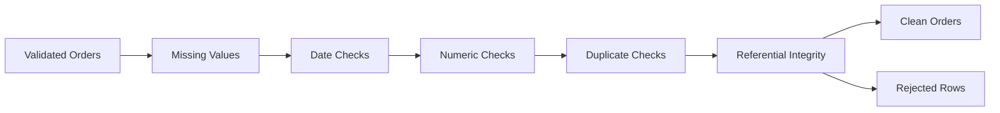
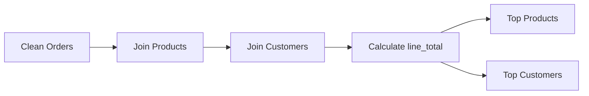
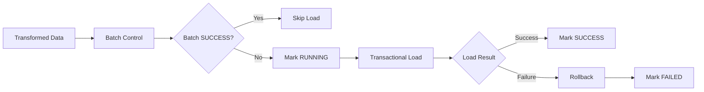
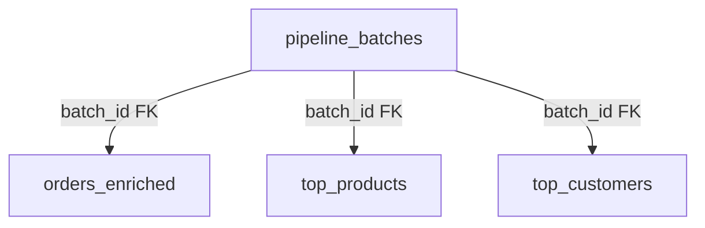
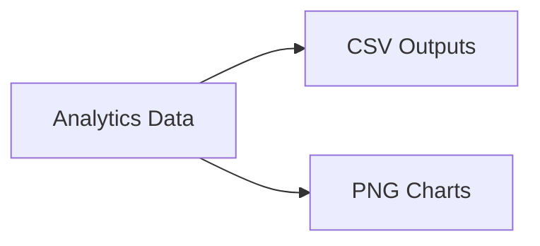
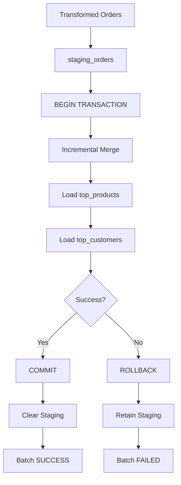

**# Data Engineering Lab 🚀****

> ********May the pipeline be with you.******

A local batch data engineering project built with ****Python, pandas, PostgreSQL, SQLAlchemy, and Docker**** to move questionable CSV files from the ****Dark Side of raw data**** toward clean, enriched, persistent, and actually useful analytics.

The project started as a recreation of the KodeKloud ****Data Engineering Fundamentals**** pipeline and evolved into a modular, tested Python pipeline with centralized orchestration, structured logging, transactional PostgreSQL loading, explicit database schemas, and Alembic migrations.

The sample dataset happens to involve Star Wars characters buying suspicious amounts of coffee.

Apparently even Darth Vader needs caffeine.

**---**

**## 🚀 The Pipeline****

Our mission is simple:

****Take messy orders. Reject Sith data. Produce Jedi analytics.****



The current pipeline follows five major stages:

****Ingest → Clean → Transform → Load → Serve****

Instead of one giant architecture diagram, each stage is illustrated where it is discussed.

**---**

**# 1. Ingest — A New Hope****

Every adventure begins with somebody dropping a CSV file into a folder.



The ingestion stage:

- Detects a new orders CSV.

- Checks whether we've already processed it, because processing the same file twice is how civilizations collapse.

- Loads the file using pandas.

- Validates the expected schema.

- Counts the incoming rows.

- Creates a monthly output directory.

- Saves a validated copy of the dataset.

- Archives the original raw file.

- Records the ingestion event in an audit log.

The expected orders schema is:

```text

order_id

customer_id

product_id

quantity

order_date

```

If an incoming filename already exists in the ingestion log, the pipeline skips it.

Hopefully valid CSV leaves.

**---**

**# 2. Clean — The Data Strikes Back****

Raw data cannot be trusted.

Not even slightly.



The cleaning stage checks for:

- Missing required values.

- Dates that aren't actually dates.

- Numbers that aren't actually numbers.

- Negative numeric values.

- Duplicate rows.

- Customers who apparently don't exist.

- Products that apparently don't exist.

- Other disturbances in the data Force.

Customer and product checks provide basic ****referential integrity**** between orders and the reference datasets.

Bad records aren't silently destroyed. They are preserved in:

```text

orders_dropped.csv

```

because good data engineering means keeping evidence of what happened.

**### Current casualty report****

The original sample batch contains 50 incoming orders.

\| Status | Rows |

\| --- | ---: |

\| Entered the pipeline | 50 |

\| Banished to the Dark Side | 10 |

\| Survived cleaning | 40 |

The rejected records included:

```text

Missing required values:     1

Invalid dates:               2

Invalid quantities:          2

Duplicate rows:              0

Invalid customer IDs:        4

Invalid product IDs:         1

```

****80% survival rate. The Force was reasonably strong with this dataset.****

The cleaning stage produces:

```text

orders_clean.csv

orders_dropped.csv

```

**---**

**# 3. Transform — Return of the JOIN****

Now that the data is trustworthy, we can actually do something with it.



The cleaned orders are enriched using:

```text

customers.csv

products.csv

```

The transformation stage adds:

- Customer names.

- Product names.

- Product prices.

It then calculates revenue for each order line:

```text

line_total = quantity × price

```

The enriched dataset is saved as:

```text

orders_enriched.csv

```

**## ☕ Top Products by Revenue****

\| Product | Revenue |

\| --- | ---: |

\| Blue Milk Latte | $103.50 |

\| Wookiee Cappuccino | $73.50 |

\| Tatooine Mocha | $72.00 |

****Blue Milk Latte wins.****

**## 👑 Top Customers by Spend****

\| Customer | Spend |

\| --- | ---: |

\| Chewbacca | $62.00 |

\| Leia Organa | $59.50 |

\| Darth Vader | $53.50 |

****Chewbacca is our best customer.****

This raises questions the pipeline is not currently equipped to answer.

**---**

**# 4. Load — Attack of the PostgreSQL**

Version 4 turns the PostgreSQL load into a transactional, schema-managed database stage.



The database load stage writes:

```text

orders_enriched

top_products

top_customers

pipeline_batches

```

Each load receives a batch identifier derived from the incoming filename:

```text

orders_2025_10.csv

        ↓

orders_2025_10

```

Persisted analytical records include:

```text

batch_id

loaded_at

```

The `pipeline_batches` control table records the lifecycle of each database load:

```text

RUNNING → SUCCESS

        ↘ FAILED

```

Successful batches are idempotent. If a `batch_id` has already completed successfully, the loader skips it rather than inserting duplicate data.

The three analytical tables are loaded inside a database transaction. If any write fails, the transaction is rolled back and the batch is recorded as `FAILED`. A successful transaction is committed and recorded as `SUCCESS`.



The explicit SQLAlchemy schema now defines database-level guarantees:

- Composite primary key `(batch_id, order_id)` on `orders_enriched`.

- Composite primary key `(batch_id, product_id)` on `top_products`.

- Composite primary key `(batch_id, customer_id)` on `top_customers`.

- Foreign keys from all analytical tables to `pipeline_batches`.

- A `CHECK` constraint limiting batch status to `RUNNING`, `SUCCESS`, or `FAILED`.

- Required `NOT NULL` fields.

- A real PostgreSQL `date` type for `order_date`.

- Timezone-aware load and batch timestamps.

PostgreSQL runs locally in Docker, SQLAlchemy provides the Python database interface, and Alembic manages schema evolution.

**## 🧬 Database Migrations**

Database changes are versioned with Alembic rather than requiring tables to be dropped and recreated.

Check the current database revision:

```bash

alembic current

```

Apply pending migrations:

```bash

alembic upgrade head

```

The initial v0.4 migration also safely backfills historical batch-control records before applying foreign-key constraints.

**---**

**# 5. Serve — Revenge of the Charts****

Persistent data is useful. Humans still appreciate something they can actually look at.



The serving stage generates:

```text

top_products.csv

top_customers.csv

top_products.png

top_customers.png

```

The CSV files provide reusable analytical datasets.

Matplotlib turns the aggregates into bar charts so humans don't have to stare at DataFrames all day.

**---**

**# 🧩 From Scripts to a Data Pipeline****

The project has deliberately evolved in stages.

**## Version 1 — Learn the Pieces****

```text

pipeline/

├── ingest.py

├── clean.py

├── transform.py

└── serve.py

```

Each stage was developed and executed independently.

**## Version 2 — Make It Reusable and Testable****

```text

pipeline_v2/

├── __init__.py

├── ingest.py

├── clean.py

├── transform.py

└── serve.py

```

Each stage exposes a `run()` function, and `run_pipeline_v2.py` coordinates execution.

Version 2 introduced centralized configuration, structured logging, unit tests, integration testing, and reusable stage interfaces.

**## Version 3 — Persist the History****

```text

pipeline_v3/

├── __init__.py

├── database.py

└── load.py

```

The v3 runner coordinates:

```text

Ingest

   ↓

Clean

   ↓

Transform

   ↓

Load to PostgreSQL

   ↓

Serve

```

The database loader supports historical batch accumulation and duplicate-batch protection.

The project currently has ****11 automated tests**** covering ingestion, cleaning, transformation, serving, transactional loading, rollback behavior, schema creation, constraints, and end-to-end pipeline behavior.


**## Version 4 — The Schema Awakens**

```text

pipeline_v3/

├── __init__.py

├── batches.py

├── database.py

├── load.py

└── schema.py

migrations/

└── versions/

```

Version 4 adds production-style database controls:

- Batch lifecycle tracking with `RUNNING`, `SUCCESS`, and `FAILED`.

- Transactional multi-table loads.

- Rollback behavior when a database write fails.

- Explicit SQLAlchemy table definitions.

- Composite primary keys and foreign keys.

- Database `CHECK` and `NOT NULL` constraints.

- Alembic schema migrations.

- Historical batch-control backfilling.

- Schema and constraint tests.

The project currently has ****11 automated tests**** covering ingestion, cleaning, transformation, serving, transactional loading, rollback behavior, schema creation, database constraints, and end-to-end pipeline behavior.

**---**


**## Version 5 — The Staging Menace**

```text
pipeline_v3/
├── __init__.py
├── batches.py
├── database.py
├── load.py
├── schema.py
└── staging.py
```

Version 5 adds a recoverable incremental loading architecture:

- Persistent `staging_orders`.
- Date normalization before staging.
- Incremental staging-to-curated merge.
- Atomic promotion of `orders_enriched`, `top_products`, and `top_customers`.
- Transaction rollback when any curated write fails.
- Staging retention after failed promotion.
- Resume support for already-ingested failed batches.
- Alembic-managed staging schema.
- Dedicated staging, rollback, resume, schema, and v0.5 integration tests.



The project currently has **16 automated tests**.

**---**

**# 📁 Project Structure**

```text

data-engineering-lab/

│

├── data/

│   ├── archive/

│   ├── customers.csv

│   └── products.csv

│

├── insights/

│   └── YYYY_MM/

│       ├── orders.csv

│       ├── orders_clean.csv

│       ├── orders_dropped.csv

│       ├── orders_enriched.csv

│       ├── top_products.csv

│       ├── top_customers.csv

│       ├── top_products.png

│       └── top_customers.png

│

├── logs/

│   ├── ingest_log.csv

│   └── pipeline.log

│

├── pipeline/

│   ├── ingest.py

│   ├── clean.py

│   ├── transform.py

│   └── serve.py

│

├── pipeline_v2/

│   ├── __init__.py

│   ├── ingest.py

│   ├── clean.py

│   ├── transform.py

│   └── serve.py

│

├── pipeline_v3/

│   ├── __init__.py

│   ├── database.py

│   └── load.py

│

├── tests/

│   ├── test_clean.py

│   ├── test_ingest.py

│   ├── test_load.py

│   ├── test_pipeline_integration.py

│   ├── test_serve.py

│   └── test_transform.py

│

├── config.py

├── logging_config.py

├── docker-compose.yml

├── pytest.ini

├── run_pipeline_v2.py

├── run_pipeline_v3.py

├── .gitignore

└── README.md

```

**---**

**# ⚡ Execute Order 66****

Okay, not ****that**** Order 66.

Create and activate a virtual environment:

```bash

python3 -m venv .venv

source .venv/bin/activate

```

Install the dependencies:

```bash

pip install pandas matplotlib sqlalchemy psycopg2-binary pytest alembic

```

Start PostgreSQL:

```bash

docker compose up -d

docker compose ps

```

Configure the database environment variables required by `pipeline_v3/database.py`.

Place an orders file in `data/`:

```text

data/

├── customers.csv

├── products.csv

└── orders_2025_10.csv

```

Run the v3 pipeline:

```bash

python run_pipeline_v3.py

```

One command executes:

```text

Detect

  ↓

Duplicate Check

  ↓

Ingest

  ↓

Clean

  ↓

Transform

  ↓

Historical PostgreSQL Load

  ↓

Serve

```

No stormtroopers required.

Run the automated tests with:

```bash

pytest -v

```

The current suite contains ****11 tests****.

**---**

**# 🔍 Data Engineering Concepts Demonstrated****

**### Batch ingestion****

Incoming order files are processed as discrete batches.

**### Idempotency****

The ingestion layer prevents repeated input-file processing, while the database layer independently prevents repeated `batch_id` loads.

**### Schema validation****

Incoming files are checked against an expected structure before downstream processing.

**### Data-quality validation****

Records are checked for missing values, malformed dates, invalid numeric fields, and duplicates.

**### Referential integrity****

Orders must reference customers and products that actually exist.

A surprisingly high bar for the Empire.

**### Auditability****

Rejected records are preserved, raw files are archived, and structured logs record pipeline activity.

**### Data enrichment****

Orders are joined with customer and product reference datasets.

**### Derived metrics****

Revenue is calculated from `quantity × price`.

**### Aggregation****

The pipeline calculates product revenue and customer spending.

**### Historical persistence****

PostgreSQL retains multiple batches rather than replacing the previous month's transformed data.

**### Batch metadata****

Persisted records include `batch_id` and `loaded_at`.

**### Batch lifecycle tracking**

The `pipeline_batches` table records whether a database load is `RUNNING`, `SUCCESS`, or `FAILED`, along with row counts and timestamps.

**### Transactional loading**

The analytical tables are loaded as a transaction. A failure rolls back the data writes rather than leaving a partially loaded batch.

**### Database constraints**

Composite primary keys, foreign keys, `NOT NULL` rules, and a batch-status `CHECK` constraint enforce integrity in PostgreSQL itself.

**### Schema migrations**

Alembic versions database changes so the schema can evolve without dropping and recreating production-style tables.

**### Modular design****

Pipeline stages are reusable functions rather than one giant script held together by hope.

**### Orchestration****

`run_pipeline_v3.py` coordinates the complete workflow.

**### Automated testing****

Unit and integration tests validate individual stages and end-to-end behavior.

**### Containerized infrastructure****

PostgreSQL runs as a Docker Compose service.

**### Serving****

Processed analytical datasets and visualizations are produced for downstream consumption.

**---**

**# 🏷️ Version History****

**## v0.1.0 — The Pipeline Awakens****

The first working end-to-end modular batch pipeline, including ingestion, cleaning, enrichment, aggregation, CSV analytics, visualizations, and single-command orchestration.

Most importantly:

```text

50 orders entered.

40 orders survived.

Chewbacca bought the most coffee.

```

Science.

**## v0.2.0 — The Tests Strike Back****

The pipeline gained engineering guardrails:

- Centralized configuration.

- Structured logging.

- Unit tests.

- Integration testing.

- Improved project documentation.

**## v0.3.0 — Return of the Database****

Version 3 introduces:

- PostgreSQL 16.

- Docker Compose.

- SQLAlchemy and psycopg2.

- A dedicated database loading stage.

- Historical batch accumulation.

- `batch_id` and `loaded_at` metadata.

- Duplicate-batch protection.

- Database loader testing.

- Seven automated tests.

October and November can now coexist peacefully in PostgreSQL.

For now.

**---**

**## v0.4.0 — The Schema Awakens**

Version 4 strengthens the persistence layer with:

- A `pipeline_batches` control table.

- `RUNNING`, `SUCCESS`, and `FAILED` batch lifecycle states.

- Transactional multi-table database loads.

- Rollback and failed-batch tracking.

- An explicit SQLAlchemy schema.

- Composite primary keys.

- Foreign-key relationships.

- Database `CHECK` and `NOT NULL` constraints.

- Alembic schema migrations.

- Historical batch metadata backfilling.

- Eleven automated tests.

The database is no longer just somewhere pandas sends DataFrames. It now actively protects the integrity of the pipeline.

**---**


**## v0.5.0 — The Staging Menace**

Version 5 introduces:

- Persistent `staging_orders`.
- Incremental staging-to-curated loading.
- Atomic curated-table promotion.
- Rollback on partial database failure.
- Retained staging data for retry and debugging.
- Resumable already-ingested failed batches.
- Alembic migration `4d17adec9a3e` for the staging schema.
- **16 automated tests passing.**

A batch can now fail dramatically, recover gracefully, and continue without pretending the raw file was never ingested.

**---**

**# 🛠️ What's Next?****

The pipeline now has modular processing, tests, logging, Dockerized PostgreSQL, historical batch storage, transactional loading, explicit schema enforcement, and versioned database migrations.

Possible future iterations include:

- PostgreSQL-native integration tests.

- More advanced incremental / change-data strategies.

- Workflow orchestration.

- Bronze / Silver / Gold data architecture.

- PySpark.

- Distributed processing.

- Databricks-style architecture.

- AWS-native data services.

Eventually this tiny coffee pipeline may become a distributed data platform.

Or it may discover that Chewbacca has a caffeine problem.

We'll see which happens first.

**---**

**## Technologies****

- Python

- pandas

- Matplotlib

- PostgreSQL 16

- SQLAlchemy

- Alembic

- psycopg2

- Docker / Docker Compose

- pytest

- Git

- WSL2

- Visual Studio Code

**---**

****Built while learning data engineering one questionable CSV at a time.****